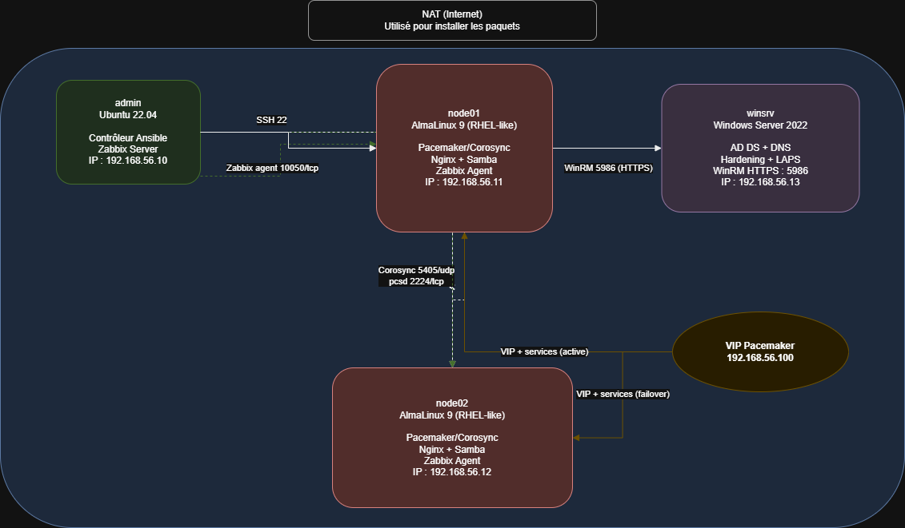
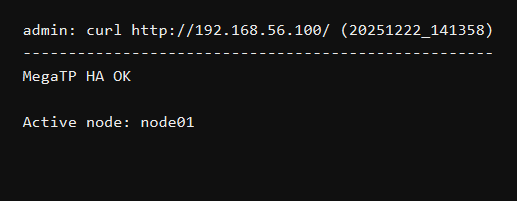
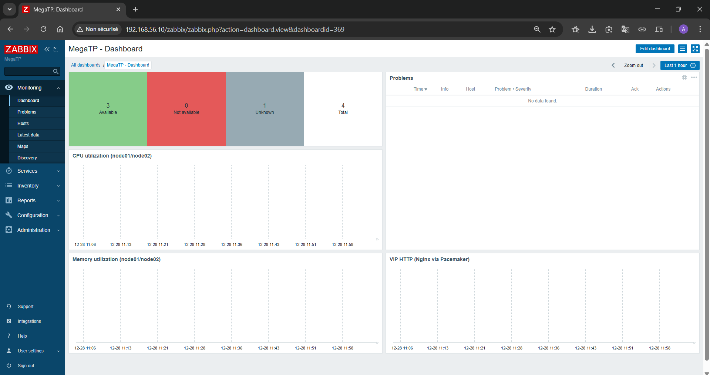

# Mega TP – Administration de systèmes répartis (Vagrant + Ansible)

Objectif : déployer une infra **4 VM** via **un Vagrantfile unique**, et tout configurer automatiquement (Ansible) :
- **HA** Pacemaker/Corosync + **VIP** + **Nginx** + **Samba**
- **Hardening Linux** (firewalld, SSH root off, mises à jour de sécurité auto)
- **Zabbix** (server + agents + dashboard)
- **Windows AD** + hardening + **LAPS**

## Architecture

Schéma Draw.io (éditable) :
- `docs/mega_tp_architecture.drawio`
- Export PNG :
  - `docs/mega_tp_architecture-drawio.png`

| VM | OS (box) | Rôle | IP host-only |
|---|---|---|---|
| `admin` | Ubuntu 22.04 (`generic/ubuntu2204`) | contrôleur Ansible + Zabbix Server | `192.168.56.10` |
| `node01` | AlmaLinux 9 (`generic/alma9`) | nœud cluster HA | `192.168.56.11` |
| `node02` | AlmaLinux 9 (`generic/alma9`) | nœud cluster HA | `192.168.56.12` |
| `winsrv` | Windows Server 2022 (`jborean93/WindowsServer2022`, v`1.2.0`) | AD + hardening + LAPS | `192.168.56.13` |

Réseau :
- 2 NIC par VM : **NAT** (Internet) + **host-only** `192.168.56.0/24` (management + cluster).
- VIP Pacemaker : `192.168.56.100` (bascule entre `node01/node02`).

## Prérequis (hôte Windows 11)
- VirtualBox + Vagrant installés.
- Ressources conseillées : **12–16 Go RAM** et **30+ Go de libre**.
- Réseau host-only VirtualBox en `192.168.56.0/24` (Vagrant le gère généralement, sinon le créer dans VirtualBox).

## Démarrage 100% automatisé

### Full (Linux + Windows)

Depuis PowerShell (dans `mega-tp_final_en_cour`) :
- `vagrant up`

Le provisionnement Ansible est déclenché automatiquement sur `admin` (voir `Vagrantfile`).

### Linux only (pour avancer/debug)

Option 1 (PowerShell) :
- `$env:MEGATP_LINUX_ONLY='1'; vagrant up node01 node02 admin; Remove-Item Env:MEGATP_LINUX_ONLY`

Option 2 :
- `.\scripts\run.ps1 -LinuxOnly`

## Validation (preuves “Julien-proof”)

Linux :
- `vagrant ssh admin -c "bash /vagrant/scripts/admin/validate.sh"`
- `vagrant ssh admin -c "bash /vagrant/scripts/admin/validate.sh --failover --reboot-test"`

Windows :
- `vagrant ssh admin -c "bash /vagrant/scripts/admin/validate_windows.sh"`

## Captures pour le rendu (dans `docs/proofs/`)

Génération automatique (depuis l’hôte Windows, dans `mega-tp_final_en_cour`) :
- `.\scripts\proofs\capture_proofs.ps1`
- `.\scripts\proofs\capture_proofs.ps1 -OpenZabbix` (ouvre Zabbix + VIP + dossier pour faire la capture du dashboard)

Fichiers attendus :
- `docs/proofs/pcs_status.png`
- `docs/proofs/vip_page.png`
- `docs/proofs/zabbix_dashboard.png` (capture manuelle du dashboard via navigateur)

Exemples :

## Paramètres (lab)

Les valeurs par défaut sont des valeurs de lab (le correcteur doit pouvoir faire `vagrant up` sans input). À changer si ton prof l’exige :
- Cluster : `ansible/roles/cluster_ha/defaults/main.yml` (`hacluster_password`)
- Zabbix : `ansible/roles/zabbix_server/defaults/main.yml` (`zabbix_db_password`)
- Windows : `ansible/roles/windows_ad/defaults/main.yml` (`domain_safe_mode_password`, `domain_name`)

## Limites assumées (lab)
- “HA” = **bascule logique** (toutes les VM tournent sur le même host VirtualBox).
- **Samba HA** : disponibilité du point d’accès (VIP + service) sans stockage partagé -> **pas** de garantie de cohérence des données (limitation de périmètre lab).

## Logs
- Logs horodatés (run complet + Ansible) : sur `admin` dans `/home/vagrant/tp/logs`.
- Copie automatique sur l’hôte (via le shared folder) : `scripts/logs/admin/`.
- `scripts/logs/` et `.vagrant/` sont ignorés via `.gitignore`.

## Arborescence
- `Vagrantfile` : 4 VM + réseau + bootstrap WinRM (Windows) + provision Ansible sur `admin`.
- `ansible/` : `site.yml`, `site_linux.yml`, `site_windows.yml`, `security.yml`, `windows.yml`, `hosts`, rôles.
- `scripts/admin/run_all.sh` : bootstrap + exécution Ansible (logs horodatés + état).
- `scripts/admin/validate.sh` : validations Linux (+ failover/reboot).
- `scripts/admin/validate_windows.sh` : validations Windows (AD/hardening/LAPS).

